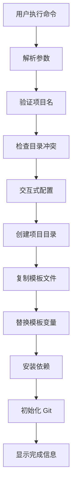

# 技术方案文档

## 项目架构设计

### 整体架构

```
@web.worker/create-astro-exe/
├── package.json              # npm 包配置
├── bin/
│   └── create-astro-exe.js   # CLI 入口文件
├── lib/
│   ├── cli.js               # CLI 核心逻辑
│   ├── template.js          # 模板处理逻辑
│   └── utils.js             # 工具函数
├── template/                # Astro 项目模板
│   ├── package.json.template
│   ├── astro.config.mjs
│   ├── src/
│   │   ├── pages/
│   │   │   └── index.astro
│   │   └── components/
│   │       └── Layout.astro
│   ├── public/
│   │   └── favicon.svg
│   └── README.md.template
└── README.md               # 使用文档
```

### 核心模块设计

#### 1. CLI 入口模块 (bin/create-astro-exe.js)
- **职责**：作为 npm create 命令的入口点
- **功能**：解析命令行参数，调用核心 CLI 逻辑
- **接口**：支持 `npm create @web.worker/astro-exe [project-name]`

#### 2. CLI 核心逻辑 (lib/cli.js)
- **职责**：处理项目创建的主要流程
- **功能**：
  - 参数验证和项目名处理
  - 目录冲突检测和创建
  - 调用模板处理模块
  - 依赖安装和 Git 初始化
  - 用户交互和进度显示

#### 3. 模板处理模块 (lib/template.js)
- **职责**：处理模板文件的复制和变量替换
- **功能**：
  - 递归复制模板文件
  - 模板变量替换（{{projectName}}, {{description}} 等）
  - 文件重命名（.template 后缀处理）

#### 4. 工具函数模块 (lib/utils.js)
- **职责**：提供通用工具函数
- **功能**：
  - 文件系统操作封装
  - 命令执行封装
  - 错误处理和日志输出

## 技术选型

### 核心依赖
- **Node.js**: >= 16 (ESM 支持)
- **inquirer**: 交互式命令行界面
- **chalk**: 彩色终端输出
- **ora**: 进度指示器
- **fs-extra**: 增强的文件系统操作

### 模板引擎
- 使用简单的字符串替换，支持 `{{variableName}}` 语法
- 支持条件模板文件（.template 后缀）

## 实现细节

### 1. npm create 支持
```json
{
  "name": "@web.worker/create-astro-exe",
  "bin": {
    "create-astro-exe": "./bin/create-astro-exe.js"
  }
}
```

### 2. CLI 参数处理
```bash
# 支持的命令格式
npm create @web.worker/astro-exe
npm create @web.worker/astro-exe my-project
npm create @web.worker/astro-exe my-project --template basic
```

### 3. 模板变量系统
```javascript
const templateVars = {
  projectName: 'my-astro-app',
  description: 'My awesome Astro application',
  author: 'John Doe',
  version: '0.0.1'
};
```

### 4. 错误处理策略
- **目录冲突**：提示用户选择覆盖、跳过或重命名
- **网络异常**：提供离线模式或重试机制
- **权限问题**：清晰的错误提示和解决建议
- **中断处理**：清理临时文件，恢复初始状态

## 数据流设计



## 接口设计

### CLI 接口
```javascript
// lib/cli.js
export class CLI {
  async run(args) {
    // 主要执行流程
  }
  
  async promptConfig() {
    // 交互式配置
  }
  
  async createProject(config) {
    // 创建项目
  }
}
```

### 模板处理接口
```javascript
// lib/template.js
export class TemplateProcessor {
  async copyTemplate(templateDir, targetDir, variables) {
    // 复制并处理模板
  }
  
  replaceVariables(content, variables) {
    // 变量替换
  }
}
```

## 依赖管理

### 生产依赖
```json
{
  "inquirer": "^9.0.0",
  "chalk": "^5.0.0",
  "ora": "^6.0.0",
  "fs-extra": "^11.0.0"
}
```

### 开发依赖
```json
{
  "eslint": "^8.0.0",
  "prettier": "^3.0.0",
  "vitest": "^1.0.0"
}
```

## 风险评估与回滚方案

### 主要风险
1. **模板版本兼容性**
   - 风险：Astro 版本更新导致模板过时
   - 回滚：维护多个模板版本，支持版本选择

2. **依赖安装失败**
   - 风险：网络问题或依赖冲突
   - 回滚：提供跳过安装选项，生成安装指引

3. **跨平台兼容性**
   - 风险：路径分隔符、权限问题
   - 回滚：使用 path 模块，统一错误处理

### 回滚策略
- 操作失败时自动清理临时文件
- 提供 `--force` 选项强制覆盖
- 支持 `--dry-run` 预览模式

## 验收标准

### 功能验收
- [ ] `npm create @web.worker/astro-exe` 正常启动
- [ ] 生成的项目可以执行 `npm run dev`
- [ ] 模板变量正确替换
- [ ] 交互式配置生效
- [ ] 错误处理友好

### 性能验收
- [ ] 项目创建时间 < 30秒（包含依赖安装）
- [ ] 包体积 < 5MB
- [ ] 内存使用 < 100MB

### 兼容性验收
- [ ] Node.js 16+ 支持
- [ ] Windows/macOS/Linux 兼容
- [ ] npm/yarn/pnpm 兼容

## 实施计划

### 第一阶段：基础框架（1-2天）
1. 初始化 package.json 配置
2. 创建 CLI 入口文件
3. 实现基础的项目创建逻辑
4. 创建简单的 Astro 模板

### 第二阶段：功能完善（2-3天）
1. 添加模板变量替换
2. 实现交互式配置
3. 完善错误处理
4. 优化用户体验

### 第三阶段：测试优化（1天）
1. 全面测试各种场景
2. 性能优化
3. 文档完善
4. 准备发布

---

*技术方案版本：v1.0*
*最后更新：2024年12月*